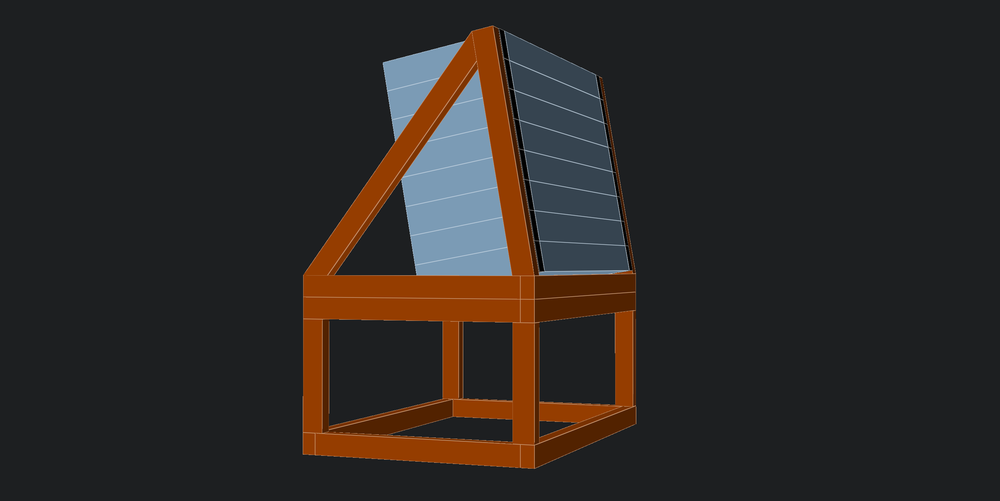

# Music table

# Rack enclosure

The rack enclosure has two parts: the riser and the frame for the rack ears. The design assumes the use of 21x33mm lumber. They come in 2400mm and 3000mm lengths where I live.

When the rack enclosure has a tilt, the two frontal beams need to be a bit longer than the actual length in units. Without this the rear corner of the rack ears would have to be dug into the horizontal beam. This offset depends on the tilt angle and can be calculated using the `Law of sines`.

In my design I override this offset to 20mm which would be the result of a tilt of about 30 degrees. I do this because I am not yet sure about the final tilt angle. The good thing is that if I start at 10 degrees and want to go up I will end up cutting my pieces shorter and shorter. At the same time the bigger the tilt the larger the offset is going to be. I know that I will not go higher than 30 degrees so if I start out with a length that would already allow 30 degrees then I can be sure that I will have enough material left for any angle between 0 and 30 degrees.

The rack ear used is an [Adam Hall 19" Parts 61535 B 8](https://www.adamhall.com/shop/af-en/19-inch-rack-accessories/19-inch-rack-rails/943/61535-b-8) which is about 22mm wide with some rounding.

## BOM for two rack enclosures

This BOM assumes that the pieces are cut from a 2400mm long piece. 5mm extra is added to the length of each item when trying to divide up lumber between them to account for the width of the saw blade and the occasional mistake.

| Length  | Count | Remarks                                                          |
| ------- | ----- | ---------------------------------------------------------------- |
| 191mm   | 8     | 90 degree ends                                                   |
| 328mm   | 4     | 90 degree ends                                                   |
| 349mm   | 8     | 90 degree ends                                                   |
| 375.6mm | 4     | 10 degree across the long side on one end                        |
| 454.7mm | 4     | 36.8 degree acros the long side on one end and 43.2 on the other |
| 536.9mm | 8     | 90 degree ends                                                   |

<table>
  <thead>
    <tr>
      <th>Lumber</th>
      <th>Cut length</th>
      <th>Count</th>
      <th>Total length</th>
      <th>Lefrover lumber</th>
      <th>Remarks</th>
    </tr>
  </thead>
  <tbody>
    <tr>
      <td rowspan="2">#1</td>
      <td>191mm</td>
      <td>7</td>
      <td>1337+35mm</td>
      <td>1028mm</td>
      <td>90 degree ends</td>
    </tr>
    <tr>
      <td>328mm</td>
      <td>3</td>
      <td>984+15</td>
      <td>29mm</td>
      <td>90 degree ends</td>
    </tr>
    <tr>
      <td rowspan="3">#2</td>
      <td>191mm</td>
      <td>1</td>
      <td>191+5mm</td>
      <td>2204mm</td>
      <td>90 degree ends</td>
    </tr>
    <tr>
      <td>328mm</td>
      <td>1</td>
      <td>328+5mm</td>
      <td>1871mm</td>
      <td>90 degree ends</td>
    </tr>
    <tr>
      <td>454.7mm</td>
      <td>4</td>
      <td>1818.8+20mm</td>
      <td>32.2mm</td>
      <td>36.8 degree acros the long side on one end and 43.2 on the other</td>
    </tr>
    <tr>
      <td rowspan="2">#3</td>
      <td>375.6mm</td>
      <td>4</td>
      <td>1502.4+20mm</td>
      <td>877.6mm</td>
      <td>10 degree across the long side on one end</td>
    </tr>
    <tr>
      <td>349mm</td>
      <td>1</td>
      <td>349+5mm</td>
      <td>580.4mm</td>
      <td>90 degree ends</td>
    </tr>
    <tr>
      <td>#4</td>
      <td>536.9mm</td>
      <td>4</td>
      <td>2147.6+20mm</td>
      <td>232.4mm</td>
      <td>90 degree ends</td>
    </tr>
    <tr>
      <td rowspan="2">#5</td>
      <td>536.9mm</td>
      <td>3</td>
      <td>1610.7+15mm</td>
      <td>774.3mm</td>
      <td>90 degree ends</td>
    </tr>
    <tr>
      <td>349mm</td>
      <td>2</td>
      <td>698+10mm</td>
      <td>66.3mm</td>
      <td>90 degree ends</td>
    </tr>
    <tr>
      <td rowspan="2">#6</td>
      <td>349mm</td>
      <td>5</td>
      <td>1745+25mm</td>
      <td>630mm</td>
      <td>90 degree ends</td>
    </tr>
    <tr>
      <td>536.9mm</td>
      <td>1</td>
      <td>536.9+5mm</td>
      <td>88.1mm</td>
      <td>90 degree ends</td>
    </tr>
  </tbody>
</table>

### Cutting the pieces to length

1. Adjust the stopper to 191mm
2. Cut 7 pieces from lumber #1
3. Cut 1 piece from lumber #2
4. Adjust the stopper to 328mm
5. Cut 3 pieces from lumber #1
6. Cut 1 piece from lumber #2
7. Adjust the stopper to 454.7mm
8. Cut 4 pieces from lumber #2
9. Adjust the stopper to 375.6mm
10. Cut 4 pieces from lumber #3
11. Adjust the stopper to 349mm
12. Cut 1 piece from lumber #3
13. Cut 2 pieces from lumber #5
14. Cut 5 pieces from lumber #6
15. Adjust the stopper to 536.9mm
16. Cut 4 pieces from lumber #4
17. Cut 3 pieces from lumber #5
18. Cut 1 piece from lumber #6

### Cutting the angled pieces

1. Adjust the cutting angle to 10 degress off and adjust the stopper for the 375.6mm piece
2. Turn the piece so that the angled end goes across the long side
3. Cut the 375.6mm pieces
4. Adjust the cutting angle to 36.8 off and adjust the stopper for the 454.7mm piece
5. Turn the piece so that the angled end goes across the long side
6. Cut the 454.7mm pieces
7. Adjust the angle to 43.2 degrees without changing the stopper
8. Cut the other end of the 454.7mm pieces, when done, the piece should form a trapezoid
