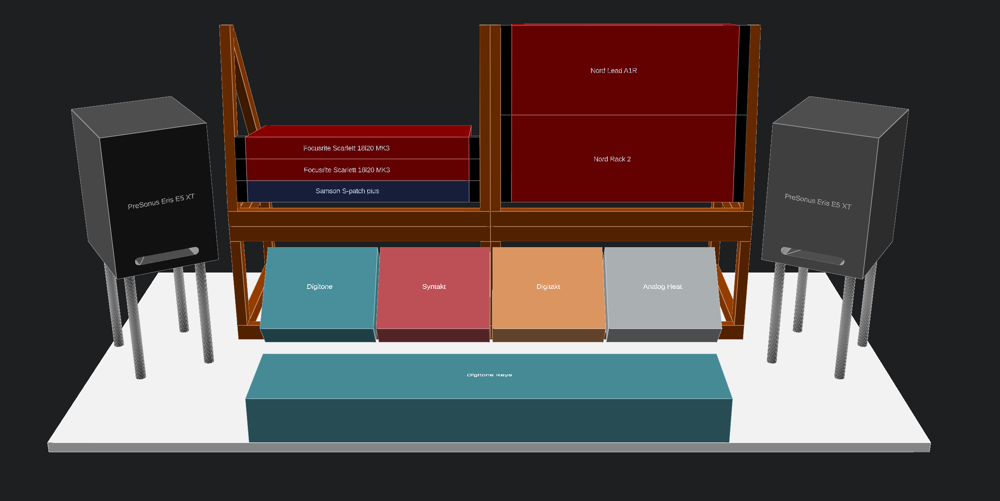

# OpenSCAD designs and modules for music gear

This is where I keep my OpenSCAD designs and modules for my music gear

The modules for music gear are really basic, mostly just cubes, but they have the correct dimensions and a label with a name.

I use VS Code for editing with the [OpenSCAD Language Support](https://marketplace.visualstudio.com/items?itemName=Leathong.openscad-language-support) extension.

I then use [OpenSCAD](https://openscad.org/) configured to re-render when the opened file changes.

# Examples

